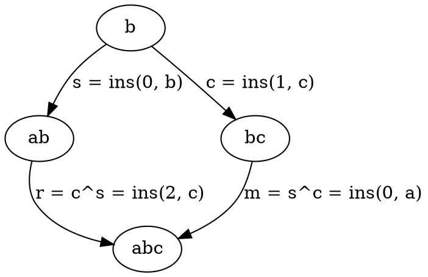

# OT&mdash;realtime collaborative editing support

The OT package implements the operational transform and consistency protocol
SOCT4, as described in [Copies convergence in a distributed real-time
collaborative environnment](https://web.archive.org/web/20041012143148/http://www.lirmm.fr/~nvidot/php/get.php?file=vidot-cscw2000.pdf),
by Nicolas VIDOT, Michelle CART, Jean FERRIÉ, and Maher SULEIMAN in Proceedings
of the 2000 ACM conference on Computer supported cooperative work. ACM Press New
York, NY, USA. pp. 171–180, with a few notable differences.

The major differences are:

#### The server always wins.
GOT4 as described works on a decentralized network of peers that communicate
directly with one another. The mcsched protocol is a client/server architecture
where all the clients mediate their communication through a central server. The
arrival time of changes at the server defines a total, global ordering of
changes for all changes in the system across all clients. This ensures that all
clients can apply the changes in the same order.

A consequence of _the server always wins_ is that the protocol makes progress
when any client disappears.

### Overview

The operational transform is correct when it preserves the user's intention and
when all clients converge on the same document after all edits have settled. The
user's intention is encoded in the system's choice of class representing the
edit, and the user's intention is preserved while guaranteeing document
convergence by the rebase and integrate algorithms.

The OT package implements the core GOT4 *forward_transform* operation in two
places: `Rebasable.rebase(a, b)` where all `b` occur before `a` in global
monotonic time, and `Versionable.integrate(a, b)` where changes in `a` and `b`
may be interleaved in monotonic time. These classes and algorithms are totally
generic and could be reused in a completely separate project. `Versionable`
also defines a monotonic client/server protocol state.

The core datastructures are: `Patchable` and its subclasses `PString` and
`PArray<E>`. The `Patch` class hierarchy operate on `Patchables`, providing
basic editing primitives like insertion, deletion, and move element.

The `Op` class hierarchy, which also extends `Rebasable`, operate on `Document`,
which represents a mcsched project (for example, using a PString to represent
the document title and a PArray to represent the ordering of tasks in the graph).
The `Op` subclasses hold `Patch`es and addresses that denote which part of the
`Document` they should be applied to.

GOT4 also requires a consistent, monotonic, synthetic clock. `Change` is the
mc-sched specific subclass of `Versionable` responsible for aggregating groups
of `Op`s that should be applied atomically to the `Document`.

### Cross-platform requirement

These algorithms have to run exactly the same way in both the browser and on the
server, so they are written in Java and transpiled to JavaScript using
[j2cl](go/j2cl). This architecture imposes some constraints: JavaScript types
cannot implement interfaces defined in Java and must implement abstract classes
instead. JavaScript has a single `number` type that functions like a Java
`double`. This leads to type choices that seem odd to a Java developer (for
example, representing arrays of indexes as `Array<Double>`, instead of the
more familiar and more obviously correct `Array<Long>`).

### Fundamental state representation - `Patchable`.

User-editable text in mcsched is backed by a [`Patchable`](Patchable.java)
[`PString`](PString.java). For example, when the user edits the project title,
the browser emits a `changed` event. We wrap the input element's value in a
`PString` and generate a patch from the original value using
`PString.makePatch`.

Another subclass of `Patchable` is [`PArray<T>`](PArray.java). This class
represents an ordered, random-access sequence. Mcsched uses this class to
represent the ordering of tasks in the graph.

`Patchable<C extends Patchable<C, E>, E>` is parameterized by the container
type `C` (`String` in the `PString` case, `List<E>` in the `PArray<E>` case),
as well as the element type `E`. In Python, lists and strings support the same
operations and wouldn't need separate subclasses of `Patchable`, but in both
Java and JavaScript, there is no common supertype of `string` and `array` that
allows for treating them uniformly, despite the conceptual similarities.

### Representing user intention on Patchables - `Patch`.
Fundamentally, Strings and Arrays can be patched the same way, by performing
`Patchable.makePatch`, which performs a fairly limited diff to generate one of
these three subclasses of `Patch`: [InsertPatch](InsertPatch.java),
[RemovePatch](RemovePatch.java), and [EditPatch](EditPatch.java). These encode
the user's intention to insert or remove elements at a given index within
the `Patchable`.

#### Fundamental Patches

The single-character `InsertPatch` and `RemovePatch` classes represent an
intention to add or remove a single element at a given location in the
`Patchable`, corresponding to single keypresses in the UI.

`EditPatch` encodes an intention to remove _X_ elements and replace them with
_Y_ elements, corresponding either to rapid typing (the UI debounces `change`
events that occur in quick succession, so that the UNDO operation undoes a
meaningful amount of typing, and also so the protocol can be more efficient) or
with a select-delete or select-replace user edit.

#### Decomposing and composing multi-character patches

Conceptually, an `EditPatch` can be `decomposed` into individual
single-character `InsertPatch` and `RemovePatch` patches with the same result
when applied. Likewise, a sequence of `InsertPatch` and and `RemovePatch` can
sometimes be combined into a single `EditPatch` using the `Patch.recompose()`
operation, but not always&mdash;the removes must occur at index _X_ and the
individual inserts  $I_0, .. I_n$ need to occur at $X + i$.

This is of course not always possible. The
[`CompositePatch`](CompositePatch.java) can contain non-contiguous edits,
inserts, and removes.

The `Patch.flatten()` operation optimizes a list of `Patch`es, creating
`EditPatch`es where possible, and returning a `CompositePatch` if the result is
not a single `Patch`.

#### Move patches
When the user drags a Task around in the UI, reordering it, this _could_ be
implemented as a `Remove` patch at the old location, followed by an `Insert`
patch at the new location, but this doesn't accurately reflect the user's
intention (more about this below). The [`MovePatch`](MovePatch.java) encodes
this specific user intention--moving a single collection element from
location _X_ to _Y_ within the `Patchable`.

### Preserving user intention, guaranteeing convergence

`Patch` extends [`Rebasable`](Rebasable.java), which provides the
foundational `rebase()` algorithm and defines the interface required of all
rebasable things.

Conceptually, imagine that the user has queued up patches _X_, _Y__, and _Z_
on their client. Before saving, the server delivers patches _A_, _B_, and _C_.
The mcsched OT protocol is _server wins_, which means the client must behave
as though _X_, _Y_, and _Z_ occurred after _A_, _B_, and _C_.

The OT protocol here refers to this operation as `rebase()`, by analogy with
distributed version control systems. This terminology provides natural and
meaningful names for the arguments involved. In the example, the client needs to
`rebase` _X_, _Y_, and _Z_ `atop` _A_, _B_, and _C_. It doesn't work for the
client to simply apply _A_, _B_, and _C_ to its current state though -- what if
the user and the server had edited the exact same characters? We need some set
of mutations _A'_, _B'_, _C'_ that will incorporate the server's changes
correctly even though the client already has some edits pending.

The convergence property says:
_A_ + _B_ + _C_ + _X'_ + _Y'_ + _Z'_ = _X_ + _Y_ + _Z_ + _A'_ + _B'_ + _C'_

`Rebase` produces _rebased_ patches _X'_, _Y'_, and _Z'_. However, if the client
applied these it would result in double changes, because the client's current
state has already incorporated them. The `rebase` algorithm also outputs a list
of _mutation_ patches _A'_, _B'_, and _C'_.

In this graphic example, the client and server start with shared state "b"
The server has rewritten this to "ab" by inserting _a_.
The client has rewritten this to "bc" by inserting _c_.

The rebase operation produces a rebased version of the client's change _r_,
as well as a mutation _m_ that the client can apply.

If the client applies mutation _m_ it will end up in state _abc_. If it saves
rebase _r_ to the server, the server will be in state _abc_ as well.

The `rebase` operation in SOCT4 is called *forward_transform*, and is built on
top of individual *transform* operations that operate one patch at a time.

$$p^c$$

refers to patch _p_ transformed in context _c_. `Rebasable` subclasses implement
one-patch transform as <code>Rebasable.atop<i>X</i></code>.

Every type of patch needs to define its transform in the context of every other
type of patch. That means every subclass of `Patch` has to implement `atopX` where
`X` is every other subclass of `Patch`. This is an example of a double-dispatch
mechanism, allowing type-safe access to the internals of the patch and its
context.

#### Guaranteeing convergence
Unit testing and testing single `atopX` calls are useful for a first step
implementation of a new `Patch` subclass, but randomized testing produces
significantly better coverage.

### Representing a Project - `Document` and `Op`
A mcsched project has document-level properties like `title` represented by
`PString`s. These are stored in signals and observed by the Lit elements that
render the page, so they will be updated when the backing data changes.

A project also has task nodes, with their own properties represented as
`PString`s.

`EditOp` uses an `Address` to determine which `PString` owned by the Document
to apply its change to.

Task nodes have IDs, which need to be consistent on the client
and the server. Both the client and the server keep a `nextNodeId` high-water
mark. When the client has allocated a node and discovers through a server poll()
response that it's already taken, the `Versionable.integrate()` operation will
generate a `RenameNodeOp` mutation. This keeps the node IDs from colliding.

The `Document` has a `PArray` of node IDs to represent the topological ordering
of tasks in the document. `IndexOp` holds `Patch<PArray>` patches for
modifying the ordering of patches in the document.

Creating or deleting a node is a three-part dance to allocate the Node and give
it an id (`AddNodeOp`, `DeleteNodeOp`), insert the new id into the node ordering
at the correct location (`IndexOp`), and set the initial values of the node
properties (zero or more `EditOp`s).

The `Op` subclasses are also `Rebasable`. In most cases, the `Y.atopX` methods
simply return `this` because it's not possible for `Y` to conflict with `X`
(for example, edits on separate nodes can't conflict, or edits to different
properties of the same node can't conflict).
